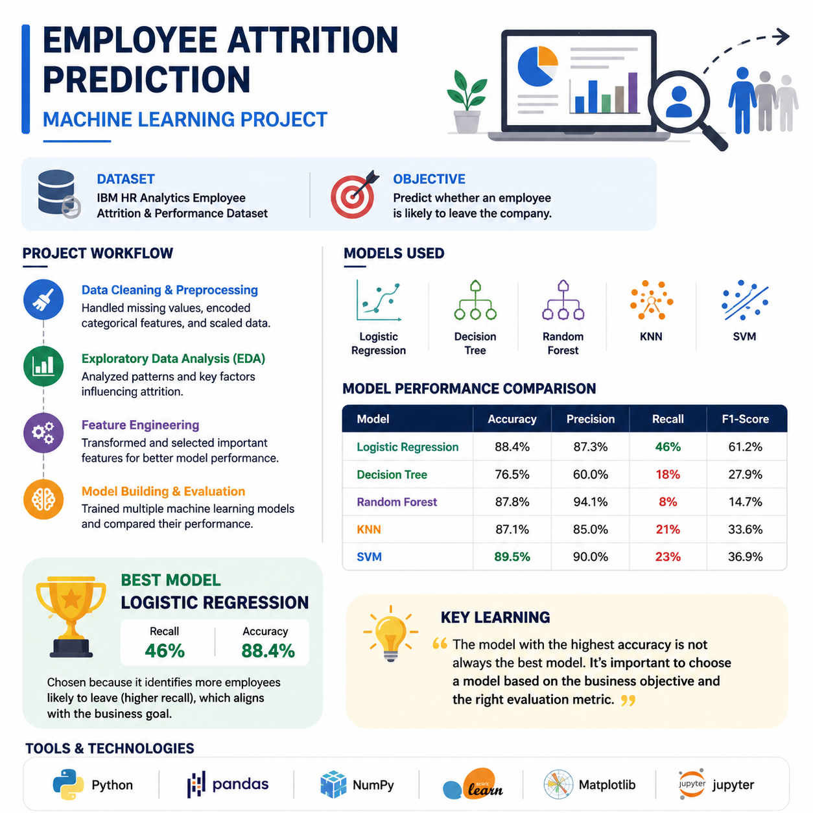

<p align="center">
  
</p>
<p align="center">
  
  
  
  
  
</p>
# Employee Attrition Prediction using Machine Learning

## 📌 Project Overview

This project predicts whether an employee is likely to leave the company using Machine Learning. Multiple classification algorithms were trained and compared to identify the best model based on business requirements.

---
## 🌟 Project Highlights

- 📊 Performed data cleaning and preprocessing
- 📈 Conducted Exploratory Data Analysis (EDA)
- ⚙️ Applied feature engineering techniques
- 🤖 Trained and compared 5 Machine Learning models
- 📉 Evaluated models using Accuracy, Precision, Recall, F1-score, and Confusion Matrix
- 🎯 Selected the best model based on business objectives instead of just accuracy

## 🎯 Business Problem

Employee attrition can negatively impact an organization through increased hiring costs, training expenses, and reduced productivity.

The objective of this project is to build a predictive model that helps HR identify employees who are at risk of leaving so that preventive actions can be taken.

---

## 📊 Dataset

- IBM HR Analytics Employee Attrition Dataset
- Total Records: 1470
- Features: 47
- Target Variable: Attrition

---

## 🛠️ Technologies Used

- Python
- Pandas
- NumPy
- Matplotlib
- Scikit-learn
- Jupyter Notebook

---

## 🤖 Machine Learning Models

- Logistic Regression
- Decision Tree
- Random Forest
- K-Nearest Neighbors (KNN)
- Support Vector Machine (SVM)

---

## 📈 Model Comparison

| Model | Accuracy | Recall |
|--------|----------|--------|
| Logistic Regression | 88.44% | **46%** |
| Decision Tree | 76.53% | 18% |
| Random Forest | 87.76% | 8% |
| KNN | 87.07% | 21% |
| SVM | **89.46%** | 23% |

---

## 💡 Key Learning

Although SVM achieved the highest accuracy, Logistic Regression was selected as the best model because it achieved the highest recall, making it more effective at identifying employees who are likely to leave.

This highlights the importance of choosing evaluation metrics based on business objectives rather than accuracy alone.

---
## 📂 Project Structure

```
employee-attrition-analysis
│
├── data/
├── notebooks/
├── images/
├── README.md
└── requirements.txt
```
## ▶️ How to Run

1. Clone the repository

```bash
git clone https://github.com/haneef333/employee-attrition-analysis.git
```

2. Install the required libraries

```bash
pip install -r requirements.txt
```

3. Open the notebook inside the `notebooks` folder and run the cells.
## 👨‍💻 Author

**Mohammed Haneef**

Aspiring Data Scientist | AI & Machine Learning Enthusiast